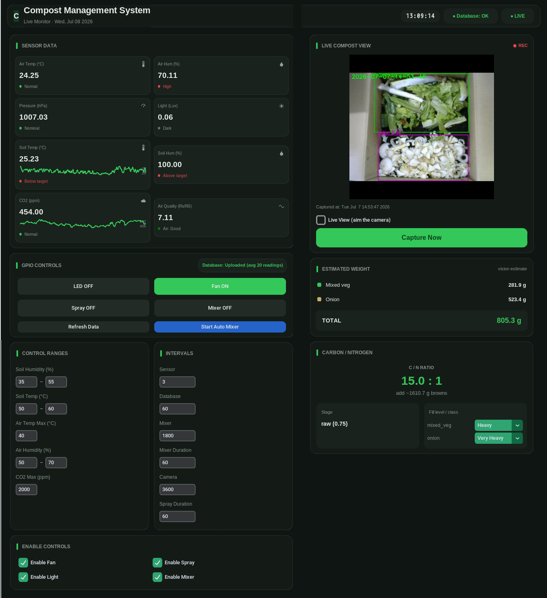

# Smart Compost Management System

An AI-assisted compost monitoring and control system running on a Raspberry Pi. It combines real-time environmental sensing, automated actuator control, and computer-vision analysis of food waste to estimate the compost's carbon-to-nitrogen (C/N) ratio — all surfaced through a live desktop dashboard and logged to a cloud database.

> Developed during a Student Internship Programme (SIP) at the **Fukuoka Institute of Technology**, Matsuo Laboratory (Information & Communication Engineering).

<!-- Replace with a real screenshot committed to the repo, e.g. docs/dashboard.png -->


---

## Features

- **Environmental monitoring** — air temperature/humidity/pressure, soil temperature/humidity, light, CO₂, and air quality, sampled on a configurable interval.
- **Automated control** — fan, spray, mixer, and light relays driven by threshold logic with hysteresis, cooldowns, and priority ordering, with manual override from the dashboard.
- **Computer vision (YOLOv8)** — two ONNX models: one detects vegetable food waste (`carrot_peels`, `mixed_veg`, `onion`), the other classifies the compost stage (`raw`, `middle`, `mature`).
- **C/N ratio estimation** — converts detections into a per-class mass estimate (box area × fill-level gram constants) and computes a mass-weighted C/N ratio, with a recommendation for how much carbon-rich "browns" to add.
- **Live dashboard** — a dark, card-based CustomTkinter UI with status pills, per-sensor status text, trend sparklines (CO₂ and soil temperature), a live camera view, and an estimated-weight breakdown.
- **Cloud + local logging** — readings are averaged and uploaded to a Neon PostgreSQL database, mirrored to a local log, and (optionally) visualised in Grafana with Telegram alerts.

---

## Repository structure

| File | Responsibility |
|------|----------------|
| `main.py` | Application entry point: builds the dashboard, runs the sensor loop, control logic, and camera workflow. |
| `Device_Library.py` | Low-level sensor drivers (BME280, SHT35, TSL2561, ADS1115/MQ135, MH-Z19C CO₂). |
| `open_cv.py` | Camera capture thread and image handling. |
| `AI_Inference.py` | YOLOv8 ONNX inference (vegetable detection + compost-stage classification). |
| `CN_Estimator.py` | Mass estimation and C/N ratio calculation. |
| `LocalLogger.py` | Local CSV/file logging of sensor readings. |
| `Database_Neon.py` | Neon PostgreSQL upload. |
| `calibrate_co2.py` | One-time MH-Z19C fresh-air zero calibration utility. |
| `Compost_Model.ipynb` | Colab notebook for dataset preparation, training, and evaluation. |

<!-- Adjust the table to match the exact filenames in your repo. -->

---

## Hardware

- Raspberry Pi (with camera module)
- **BME280** — air temperature, humidity, pressure (I²C)
- **SHT35** — soil temperature and humidity (I²C)
- **TSL2561** — ambient light / lux (I²C)
- **MQ135** — air-quality gas sensor, read via an **ADS1115** ADC
- **MH-Z19C** — NDIR CO₂ sensor (UART)
- 4-channel **relay board** (active-low) driving LED, fan, spray, and mixer

### GPIO pin map (BCM)

| Actuator | GPIO |
|----------|------|
| LED   | 25 |
| Fan   | 24 |
| Spray | 23 |
| Mixer | 22 |

> Relays are **active-low** (`0` = ON, `1` = OFF). All pins are driven HIGH (OFF) on startup and on shutdown.

---

## Software setup

### Prerequisites

- Raspberry Pi OS with I²C, SPI, and the serial port enabled (`raspi-config`)
- Python 3.9+
- `pigpio` daemon running:

```bash
sudo pigpiod
```

### Install

```bash
git clone https://github.com/<your-username>/<your-repo>.git
cd <your-repo>
pip3 install -r requirements.txt
```

The code imports, among others: `customtkinter`, `opencv-python`, `pillow`, `pigpio`, `onnxruntime`, `numpy`, and a PostgreSQL client for Neon. Pin exact versions in `requirements.txt`; `customtkinter >= 5.0` is required for the dashboard's image-based icons.

<!-- Generate requirements.txt from your working environment: `pip3 freeze > requirements.txt` -->

---

## Configuration

### 1. CO₂ sensor (MH-Z19C)

Auto-calibration (ABC) is disabled at every startup so the baseline can't drift inside the sealed, high-CO₂ bin. Before first use, run a one-time fresh-air zero calibration **away from the compost**:

```bash
python3 calibrate_co2.py
```

Follow the prompts (warm up ~20 min in fresh air, then confirm). See the script's header for details.

### 2. Air-quality sensor (MQ135)

A clean-air baseline resistance (`R0`) is stored in a JSON file and used to compute `Rs/R0` at runtime. Run the calibration script in clean air to (re)generate it, and make sure the path in `main.py` matches the file the script writes.

### 3. Database (Neon PostgreSQL)

Set your Neon connection details in `Database_Neon.py` (or via environment variables — recommended so credentials never land in version control).

> **Do not commit database URLs, API keys, or Telegram tokens.** Use a `.env` file or environment variables and add them to `.gitignore`.

---

## Usage

```bash
sudo pigpiod        # once, if not already running
python3 main.py
```

From the dashboard you can:

- Watch live sensor tiles with status text and CO₂ / soil-temp trend sparklines.
- Toggle relays manually, or run the automatic control logic and timed mixer.
- Set target ranges and intervals live (changes apply on Enter / focus-out).
- Aim the camera with the live view, then **Capture Now** to run detection.
- Adjust the fill level per detected class to recompute the C/N estimate without re-photographing.

---

## The AI model

Both detectors are YOLOv8 models exported to ONNX for on-device inference.

- **Vegetable detection:** `carrot_peels`, `mixed_veg`, `onion`
- **Compost stage:** `raw`, `middle`, `mature`

A central finding of this project is that **label quality matters more than model architecture** — swapping between YOLOv8n and YOLO11 produced essentially identical accuracy, so the bottleneck is annotation consistency, not the network. Labeling follows one region box per class-dominant area, hugging the vegetable and excluding bare soil, with intertwined or ambiguous images skipped rather than labeled loosely.

Training, dataset splitting, and evaluation (mAP, confusion matrix) are done in `Compost_Model.ipynb`.

---

## Acknowledgements

- **Prof. Keita Matsuo** — organisation supervisor, Matsuo Laboratory, Fukuoka Institute of Technology.
- The original **SmartCompost** foundation, on which this AI-driven extension is built.

---

## License

<!-- Choose a license (e.g. MIT) and add a LICENSE file, or state "All rights reserved" if this is coursework you don't intend to license. -->
_TBD._
